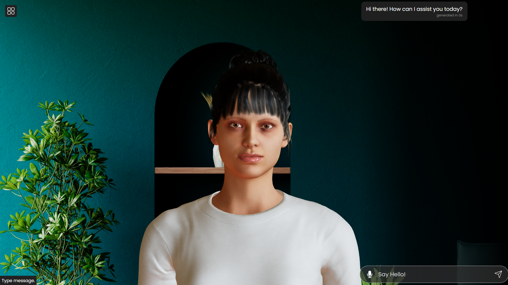

# Talking Avatar with Local Ollama

A ThreeJS-powered virtual human being that uses **local Ollama** for AI conversation and **browser text-to-speech** for natural female voice! No external APIs or internet connection required once set up.



## Features

- 🤖 **Local AI**: Powered by Ollama (no internet required)
- 🎤 **Natural Voice**: Browser-based female text-to-speech
- 👥 **3D Avatar**: Realistic talking animations with lip sync
- 🎮 **Interactive**: Voice input and text chat
- 🔒 **Privacy**: Everything runs locally on your machine

## Quick Start

### 1. Install Dependencies
```bash
npm install
# or
yarn
```

### 2. Set Up Ollama
Follow the detailed instructions in [OLLAMA_SETUP.md](OLLAMA_SETUP.md)

**Quick setup:**
```bash
# Install Ollama from https://ollama.com
# Then run:
ollama pull llama3.2
ollama serve
```

### 3. Start the Application
```bash
npm start
# or
yarn start
```

## Configuration

- **AI Model**: Edit `getOllamaResponse` function in `src/App.js` to change the model
- **Voice**: The app automatically selects the best female voice available
- **Ollama Host**: Currently set to `http://localhost:11434`

## No Backend Required! 

Unlike the original version, this updated version **doesn't require a separate backend server**. Everything runs locally:

- ✅ Local Ollama for AI responses
- ✅ Browser Web Speech API for text-to-speech  
- ✅ Client-side lip sync animation
- ❌ No external servers needed
- ❌ No API keys required

## System Requirements

- **RAM**: 8GB+ recommended (for llama3.2)
- **OS**: Windows, macOS, or Linux
- **Browser**: Chrome, Edge, Safari, or Firefox
- **Ollama**: Installed and running locally

## Troubleshooting

See [OLLAMA_SETUP.md](OLLAMA_SETUP.md) for detailed setup and troubleshooting instructions.
